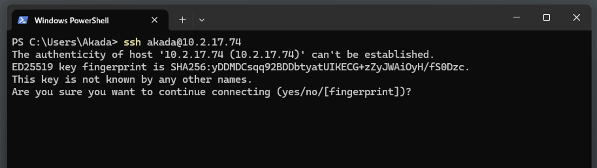
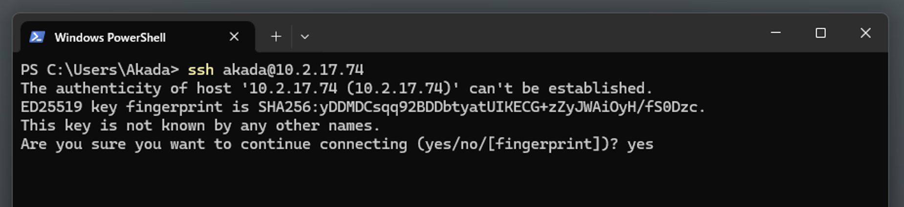
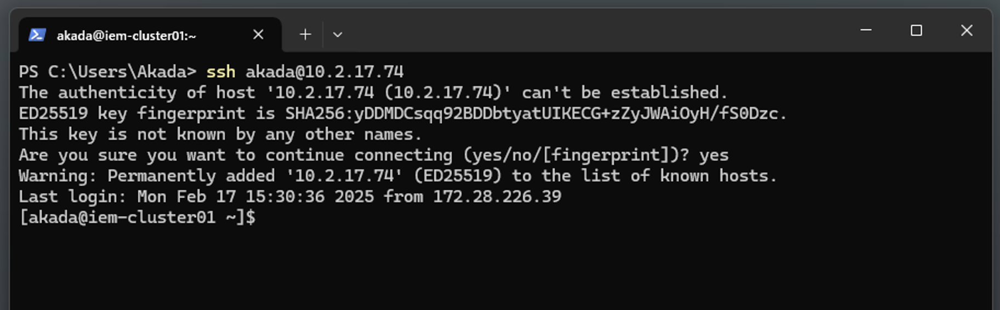
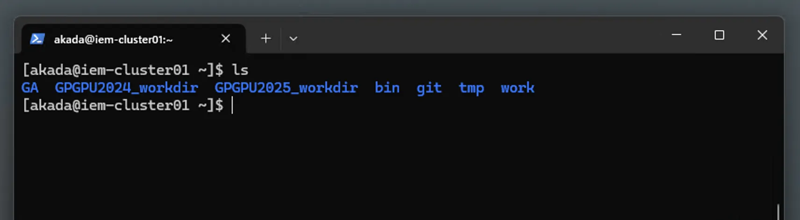
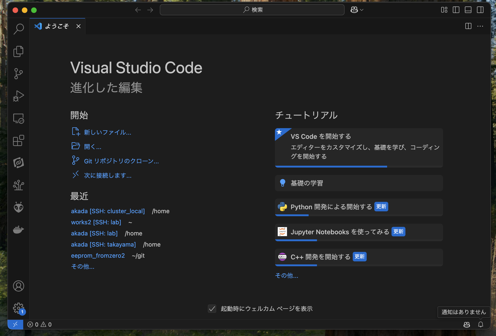
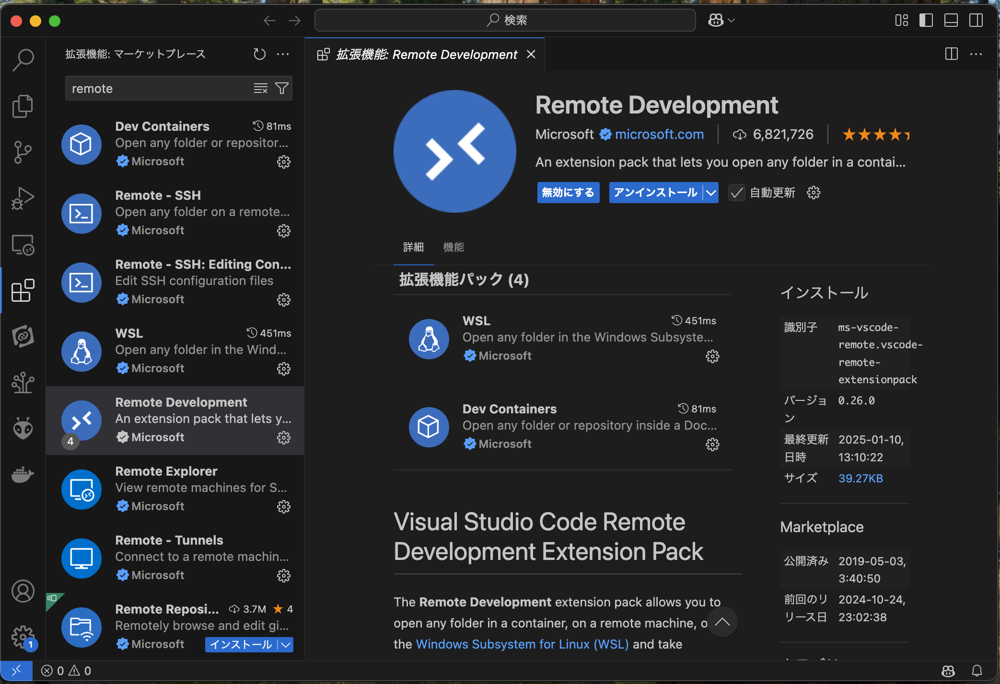
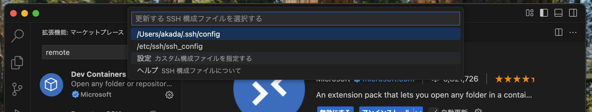
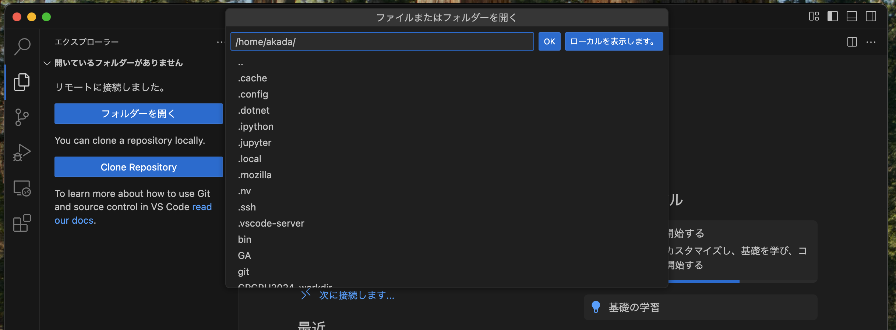
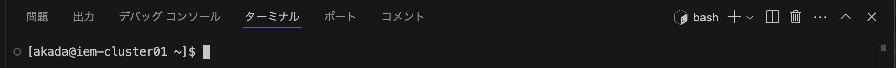

# SSHを用いた接続

- SSH: Secure SHell の略
- リモートにあるコンピュータに接続する一つの方法
- 命令はテキストコマンドで行う

## 接続してみる

ターミナルを使って接続してみる
1. Windowsキーを押したメニューで`wt`と入力＋Enter
    
2. `ssh <ユーザ名>@10.2.17.74` と入力  
    
    
    
3. 初めての場合は`fingerprint…` と表示されるので、 `yes` と入力
    
    
    
4. パスワードを求められたら入力  
    パスワードはメールアドレスの@より前の部分です。
    - 例：`p83vbjds@s.okayama-u.ac.jp` → `p83vbjds` がパスワード
5. `[name@iem-cluster01 ~]$`の様になったらリモート接続が成功しています！
    
    
    

## コマンドのお試し

- 「ls」コマンド：今いる場所のファイル一覧を表示します。
    
    


## Visual Studio Codeを用いたSSH接続

### 1. はじめに

Visual Studio Code（以下、VS Code）は、リモート環境での開発を支援する多くの機能を提供しています。特に、SSHを利用したリモート開発機能を使用することで、ローカル環境と同じようにリモートサーバー上でコードを編集・実行できます。本稿では、VS Codeを用いたSSH接続の手順を解説します。



### 2. 必要な準備

SSH接続を行うために、以下の環境が整っていることを確認してください。

- VS Code
- Remote - SSH拡張機能のインストール
- SSHクライアント（Windowsの場合はOpenSSH、macOS/Linuxは標準搭載）
- 接続先のリモートサーバー情報（ホスト名、ユーザー名、パスワードまたはSSH鍵）

### 3. SSH拡張機能のインストール

1. VS Codeを起動します。
2. 左側の拡張機能アイコンをクリックします。
3. 検索バーに「Remote」と入力し、Microsoftが提供する**Remote Development**」拡張機能をインストールします。



### 4. SSH接続の設定

#### 4.1 SSH設定ファイルの作成

1. VS Codeのコマンドパレット（`Ctrl + Shift + P` または `Cmd + Shift + P`）を開きます。
2. 「remote ssh」 と入力し、「Remote-SSH: SSH 構成ファイルを開く」を選択します。

    

1. `~/.ssh/config`（Windowsの場合は `C:\Users\ユーザー名\.ssh\config`）を開き、以下のように設定を追加します。
    
    ```
    Host node<自分のノード番号>
        HostName <自分のノード番号>
        User <ユーザ名>
        ProxyCommand ssh cluster -W %h:%p
     
    Host cluster
        HostName 10.2.17.74
        User <ユーザ名>
    ```
    

#### 4.2 SSH接続の実行

1. コマンドパレットを開き、「Remote-SSH: Connect to Host」を選択します。
2. 先ほど設定した「myserver」を選択します。
3. 初回接続時は、サーバーのフィンガープリントを受け入れるか尋ねられるので「yes」と入力します。
4. パスワードの入力を求められたら入力します。
5. 認証が完了すると、リモートサーバーの環境に接続されます。

### 5. SSH接続後の開発

リモート環境に接続後は、通常のローカル開発と同じように作業が可能です。

- **ファイルの編集**: エクスプローラーからリモートのファイルを開いて編集。
    
    
    
- **ターミナルの利用**: VS Codeのターミナルを開くと、リモートサーバー上でのシェル操作が可能。



### 6. (オプション) 公開鍵認証を設定

- 毎回パスワードを入力するのが大変な場合、公開鍵認証を設定することでパスワードの入力を省略できます。

公開鍵認証を使用する場合、事前にリモートサーバーに公開鍵を配置する必要があります。

1. ローカル環境でSSHキーを作成（まだ作成していない場合）。
    
    ```
    ssh-keygen -t rsa -b 4096 -f ~/.ssh/id_rsa
    ```
    
2. 作成した公開鍵をリモートサーバーにコピー。
    
    Linuxの場合
    ```
    ssh-copy-id -i ~/.ssh/id_rsa.pub myusername@example.com
    ```
    Windowsの場合
    ```
    cat ~/.ssh/id_rsa.pub | ssh ${user}@${host} \
    "mkdir -p ~/.ssh && chmod 700 ~/.ssh && \
    cat >> ~/.ssh/authorized_keys && chmod 600 ~/.ssh/authorized_keys"
    ```
    
3. `~/.ssh/config` に `IdentityFile` を明示的に指定。

### 7. (オプション) クラスターとノード間の自己認証の設定

クラスター環境において、ノード間の自己認証を設定する場合は、各ノードでSSH鍵を共有することが推奨されます。

1. クラスター内の全ノードで同じSSH鍵を使用する。
    
    ```
    ssh-keygen -t rsa -b 4096 -f ~/.ssh/id_rsa
    ```
    
2. 生成した公開鍵を各ノードの `~/.ssh/authorized_keys` に追加。
    
    ```
    cat ~/.ssh/id_rsa.pub >> ~/.ssh/authorized_keys
    ```
    
3. 各ノードの `~/.ssh/config` に以下の設定を追加。
