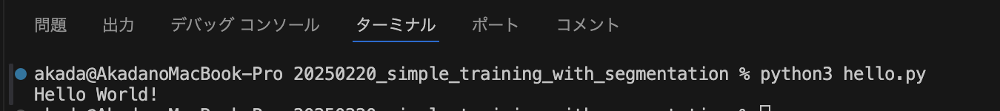
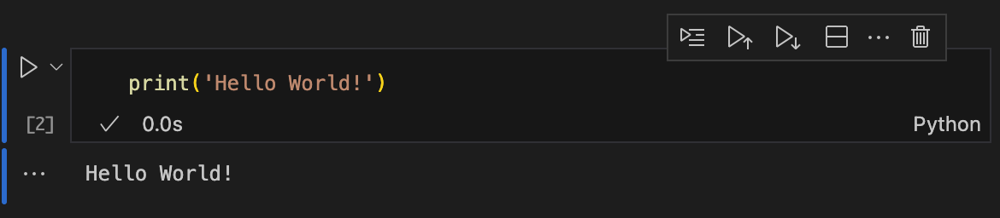
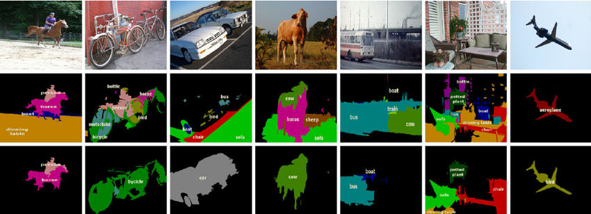
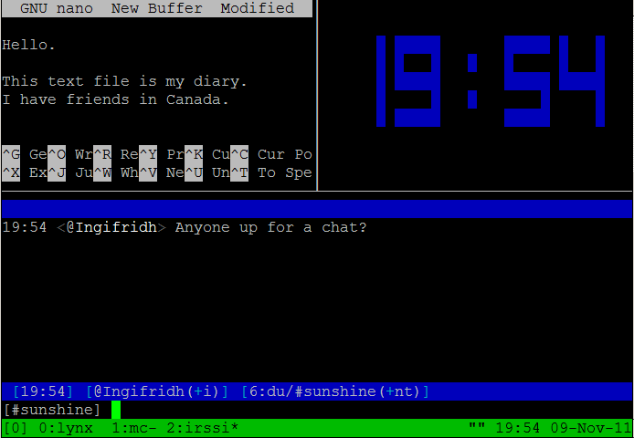

# 2/20(金)の講義の補足

## Pythonの色々な実行方法について

Pythonにはさまざまな実行方法があります。
講座で使用したVisual Studio Codeを使った方法以外に、よく使う方法を紹介します。

### 1. `.py`ファイルを使った実行（基本的な方法）

- **概要**: Pythonのコードをファイルに保存して実行する方法です。
- **実行方法**: VSCodeでPythonファイル（例えば`hello.py`）を作成し、以下のように実行します。
1. VSCodeの「ターミナル」→「新しいターミナル」を開く
2. `cd`コマンドでスクリプトのディレクトリに移動
3. `python3 hello.py`と入力してEnter
4. 結果がターミナルに表示される


### 2. VSCodeのターミナルで対話式実行（簡単な動作確認）

- **概要**: Pythonの対話モードを使い、1行ずつコードを試せます。
- **実行方法**: 
  1. VSCodeの「ターミナル」→「新しいターミナル」を開く
  2. `python`と入力してEnter
  3. Pythonのプロンプト（`>>>`）が表示されたら、直接コードを入力できます。

**例**:
```python
>>> a = 10
>>> b = 20
>>> print(a + b)
30
```

### 3. VSCodeでJupyter Notebookを使う（データ分析向け）

- **概要**: Jupyter NotebookをVSCodeで使い、コードとその結果を同じ画面で確認できます。2/21(金)の講座で演習した方法です。
- **実行方法**:
  1. VSCodeの「拡張機能」から「Jupyter」をインストール
  2. `.ipynb`ファイルを作成して開く
  3. 各セル（コードのブロック）を`Shift + Enter`で実行


## 本講座における各種データの置き場所について

講座で具体的に触れなかったデータの格納場所を示します。

### 1. Pythonのライブラリ（追加機能の保存場所）

- `pip`コマンドでインストールしたライブラリは、VSCodeでは自動的に環境内に保存されます。
- 例えば、`numpy`をインストールする場合:
  ```bash
  pip install numpy
  ```
  これでPythonプログラムから`import numpy`して使えます。

### 2. 学習データの保存場所

- 学習データ（画像など）は、本講座においては各計算ノードの`/tmp/VOCdevkit`に保存しています。

## VOCdevkitの内部構造

```
VOCdevkit/
└── VOC2012_sample
    ├── JPEGImages          # 画像データ
    ├── SegmentationClass   # 画像ごとの分類データ
    └── listfile            # 使うデータの一覧
        ├── train_list_300.txt    # 300個の学習データ
        ├── train_list_1464.txt    # 1464個の学習データ
        ├── val_list_100.txt      # 100個の検証データ
        └── val_list_100.txt      # 1449個の検証データ
```

- **JPEGImages**: 画像が入っているフォルダ
- **SegmentationClass**: 各画像の分類情報（AIが学習するラベル）
- **listfile**: どのデータを学習に使うかを指定するファイル

学習データは大量に存在していますが、すべてのデータを使用すると実行に時間がかかり過ぎてしまうため、
今回は少ないデータしか使わないようにプログラムを作成しています。
大量のデータを使ってみたい場合は、多いほうのlistfileを使用してみるといいでしょう。

# 来週までにやることリスト（pyファイルの作成）

### 1. 学習用のPythonファイルを作成しておく

JupyterNotebookはモデルの学習などの長時間の実行には向いていません。
以下のファイルを作成し、Pythonファイルの単体をターミナル上で実行できるようにしておいてください。

作成にあたっては `1_machine_learning.ipynb` を参考に、以下4つのファイルに分割してください。

1. **train.py**（学習用）: AIを訓練するプログラム
2. **dataset.py**（データ管理）: 画像データを読み込むプログラム
3. **visualize.py**（結果の可視化）: 学習したモデルに画像を入力し推論結果を表示するプログラム
4. **plot_loss.py**（学習の様子の可視化）：損失の変化をグラフで表示するプログラム

### 2. tmux(長時間の学習をターミナル上で実行する方法)の練習

機械学習のプログラムは時間がかかるので、ターミナルを閉じても動かし続ける方法を紹介します。本講座では`tmux`とよばれるソフトウェアの使用方法を紹介します。
tmuxはターミナルを管理するツールで、長時間のプロセスをバックグラウンドで実行し続けることができます。


  1. **tmuxを起動する**:
     ```bash
     tmux
     ```
  2. **プログラムの実行**:
     tmux内で`python train.py`などのコマンドを実行します。
  3. **tmuxからのデタッチ**:
     `Ctrl + b`を押した後に`d`を押すことでセッションから切断できます。
  4. **再接続**:
     ```bash
     tmux attach
     ```
     若しくは
     ```bash
     tmux a
     ```
  
  tmuxを活用することで、学習処理中にセッションが切断されても安全にバックグラウンドで実行を続けられます。

# まとめ

- Pythonの実行方法は`py`ファイル、対話式コンソール、Jupyter Notebookの3つがある
- データは`/tmp/VOCdevkit`フォルダ内で管理されている
- 来週までに`train.py`等の各種`py`ファイルを作成してみましょう
- tmuxを使ってバックグラウンド実行を試してみましょう